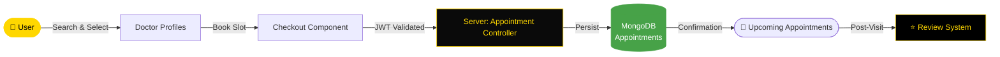

<div align="center">


[](https://git.io/typing-svg)

<br/>

<p align="center">
  <a href="https://github.com/NietoDeveloper">
    
  </a>
  <a href="https://committers.top/colombia#NietoDeveloper">
    
  </a>
  <a href="https://react.dev/">
    
  </a>
  <a href="https://firebase.google.com/">
    
  </a>
  <a href="https://redux.js.org/">
    
  </a>
  <a href="https://opensource.org/licenses/MIT">
    
  </a>
</p>

<p align="center">
  <a href="https://github.com/NietoDeveloper/MedicalCenterAppointment">
    
  </a>
</p>

</div>

---

## 📋 Overview

A **CRUD** (Create, Read, Update, Delete) application built with the **MERN** stack. The system allows users to create an account, book appointments with their preferred doctor, and leave reviews for the doctors. Doctors, on the other hand, can create profiles showcasing their experience, specialization, and availability for appointments. Once a doctor sets up their profile, they can log in to manage their appointments.

---

## 🗂️ Project Structure

```text
MedicalCenterAppointment/
├── Appointment_system/       # React frontend
│   ├── public/
│   └── src/
│       ├── API/                # Backend API service calls
│       ├── assets/
│       │   └── images/
│       ├── components/
│       │   ├── Checkout/
│       │   ├── Explainer/
│       │   ├── Faq/
│       │   ├── Footer/
│       │   ├── Header/
│       │   ├── Hero/
│       │   ├── Offerings/
│       │   └── Preview/
│       ├── context/             # React Context providers
│       ├── features/            # Redux feature slices
│       ├── hooks/                # Custom React hooks
│       ├── pages/                # View controllers
│       └── utils/                # Helper functions
├── dist/                       # Production build output
│   └── assets/
└── Server/                     # Node.js + Express backend
    ├── config/
    ├── controllers/
    ├── middleware/
    ├── models/
    └── routes/
        ├── doctorRoutes/
        └── userRoutes/
```

---

## 🔄 Appointment Booking Flow



---

## ✨ Features

- **User Authentication:** Secure JWT-based login for both users and doctors, supporting multiple devices — logging out on one device does not affect sessions on others.
- **Authorization:** Role-based access control ensures only authenticated users and doctors access their respective functionalities.
- **Profile Management:** Users can upload a profile picture; doctors can showcase experience, specialization, and appointment availability.
- **Appointment Booking:** Users can book appointments with their preferred doctors and view/manage upcoming appointments.
- **Review System:** Users can leave reviews for doctors, helping others make informed decisions.

---

## 🛠️ Technology Stack

<div align="center">

### Backend

| Technology | Role |
|:-----------|:-----|
| Node.js / Express | Server-side logic and RESTful APIs for frontend interaction |
| MongoDB | Database for user accounts, doctor profiles, appointments, and reviews |
| JWT (JSON Web Tokens) | Authentication and authorization via access and refresh tokens |
| Firebase | Storage for user profile pictures |

### Frontend

| Technology | Role |
|:-----------|:-----|
| React | User interface built to interact with the backend APIs |
| React Router | Route protection and in-app navigation |
| Redux | Session data management (user profiles, authentication status) |
| Axios & React Query | Efficient consumption of backend APIs for data retrieval and manipulation |
| Tailwind CSS | Styling and overall user experience |

</div>

---

## 🚀 Installation

**Step 1 — Clone the repository**

```bash
git clone https://github.com/NietoDeveloper/MedicalCenterAppointment
```

**Step 2 — Install frontend dependencies**

```bash
cd Appointment_system
npm install
```

**Step 3 — Install backend dependencies**

```bash
cd ../Server
npm install
```

**Step 4 — Configure environment variables**

Create a `.env` file in `Server/` with your MongoDB connection string, JWT secrets, and Firebase credentials.

**Step 5 — Run the application**

```bash
# Server
cd Server
npm start

# Appointment_system
cd Appointment_system
npm run dev
```

---

## 👨‍💻 Author

Created by **Manuel Nieto (NietoDeveloper)**.

---

## 📄 License

This project is licensed under the **MIT License**.

<div align="center">

<br/>


</div>
